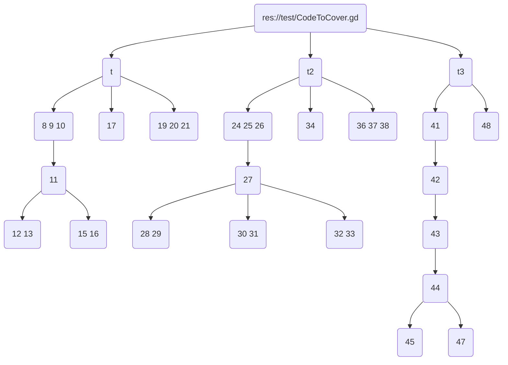

# Code Coverage

Adds code coverage reports to godot

## How to install

### Using gop
```bash
gop init
gop add gop add --dependency=felix-hellman/codecoverage --version=0.0.3
gop install
```


### Manually
Clone this repo and copy paste the pkg folder into your project

## How to use

Initiate the autoinject node that instruments your objects
```
var auto_inject = load("res://pkg/felix-hellman-codecoverage/AutoInject.gd").new()
add_child(auto_inject)
```

When autoinject exits the tree it will print out information about what it did and where the report has been saved
```
Found report for res://test/CodeToCover.gd
Found report for res://test/LoopsToCover.gd
Report saved at : /home/felix/.local/share/godot/app_userdata/CodeCoverage/coverage_report.json
```

## How it works
When an object enters the tree, the auto injector passes the object to be parsed, instrumented and rewritten.
Following will use the file" "CodeToCover.gd" as an example
<details><summary>CodeToCover.gd</summary>
<p>

```
extends Node

class_name CTC, "res://test/CodeToCover.gd"

var x = 123

func t(conditional : bool):
	var a = 1 + 1
	var b = 2 + 5
	a = b + 7
	if conditional:
		b = a - 14
		a = a * 2
	else:
		a = b - 14
		b = b * 2
	var c = a + b
	yield()
	a = a - a
	b = b - b
	return c

func t2(conditional: bool):
	var a = 1 + 1
	var b = 2 + 5
	a = b + 7
	match conditional:
		true:
			var d = 5
		false:
			var e = 7
		_:
			var f = 11
	var c = a + b
	yield()
	a = a - a
	b = b - b
	return c

func t3(conditional: bool):
	var a = 1
	if conditional:
		var b = 1
		if conditional:
			var c = 1
		else:
			var d = 5
	return a
```
</p>
</details>


### AST

When parsed, a tree structure of the file is created. This is to identify branching code which helps conditional statements to know what children needs to be visited for it self to be counted as visited on every branch. See the block containing row "11" below, it needs the blocks containing both row "12 13" and "15 16" to be visited in order to get full coverage


### Instrumentation
After creating a tree out of the source it is time for the code to be instrumented. This is done by adding emit_signal lines with a block index that corresponds to that block.
This object will then be connected to a report object that corresponds to that source file, if multiple objects of the same source is instrumented they will all be connected to the same report

<details><summary>CodeToCover.gd (Instrumented)</summary>
<p>

```
  
extends Node


var x = 123


signal register_visited
func t(conditional : bool):
	emit_signal("register_visited",1)
	var a = 1 + 1
	var b = 2 + 5
	a = b + 7
	if conditional:
		emit_signal("register_visited",3)
		b = a - 14
		a = a * 2
	else:
		emit_signal("register_visited",4)
		a = b - 14
		b = b * 2
	emit_signal("register_visited",5)
	var c = a + b
	yield()
	emit_signal("register_visited",6)
	a = a - a
	b = b - b
	return c
func t2(conditional: bool):
	emit_signal("register_visited",8)
	var a = 1 + 1
	var b = 2 + 5
	a = b + 7
	match conditional:
		true:
			emit_signal("register_visited",10)
			var d = 5
		false:
			emit_signal("register_visited",11)
			var e = 7
		_:
			emit_signal("register_visited",12)
			var f = 11
	emit_signal("register_visited",13)
	var c = a + b
	yield()
	emit_signal("register_visited",14)
	a = a - a
	b = b - b
	return c
func t3(conditional: bool):
	emit_signal("register_visited",16)
	var a = 1
	if conditional:
		emit_signal("register_visited",18)
		var b = 1
		if conditional:
			emit_signal("register_visited",20)
			var c = 1
		else:
			emit_signal("register_visited",21)
			var d = 5
	emit_signal("register_visited",22)
	return a
```
</p>
</details>
